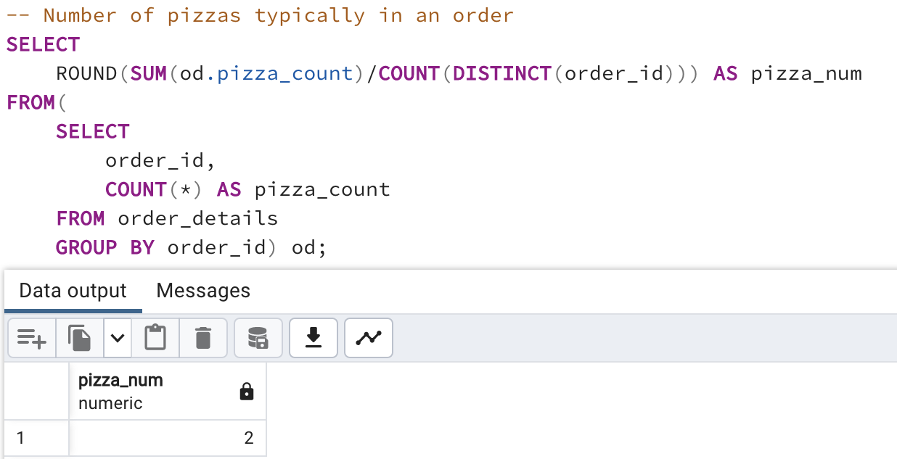

# Pizza_Place_Sales

## Overview

This project uses a year's worth of sales from a fictitious pizza place, including the date and time of each order and the pizzas served, with additional details on the type, size, quantity, price, and ingredients. The following questions will be answered:
- How many customers do we have each day? Are there any peak hours?
- How many pizzas are typically in an order? Do we have any bestsellers?
- How much money did we make this year? Can we indentify any seasonality in the sales?
- Are there any pizzas we should take of the menu, or any promotions we could leverage?

## Resources

[Link](https://www.mavenanalytics.io/data-playground) to datasets used.

## Analysis

- The Resources folder contains CSV files needed for data exploration. 

### Data Exploration with SQL

- Using DDL statements, the data in CSV files are loaded into PostgreSQL database.
- The Entity Relationship Diagram is shown below:

 

- Since we do not have customer data available, orders received per day are calculated.
  <table>
   <tr>
     <th>Orders received per day</th>
      <th>Peak hours</th>
    </tr>
    <tr>
     <td></td>
      <td></td>
    </tr>
  </table>

- The typical number of pizzas in an order is 2. Big Meat in Small size is the best seller followed by Large Thai Chicken pizza.   
  <table>
   <tr>
      <th>Pizzas per order</th>
      <th>Best sellers</th>
    </tr>
    <tr>
      <td></td>
      <td></td>
    </tr>
  </table>

-
  <table>
    <tr>
     <th>Annual Sales</th>
      <th>Seasonality</th>
    </tr>
    <tr>
      <td></td>
      <td></td>
    </tr>
  </table>

- 
  <table>
   <tr>
      <th>Least sold pizzas</th>
      <th>Promotions</th>
    </tr>
    <tr>
      <td></td>
      <td></td>
    </tr>
  </table>
