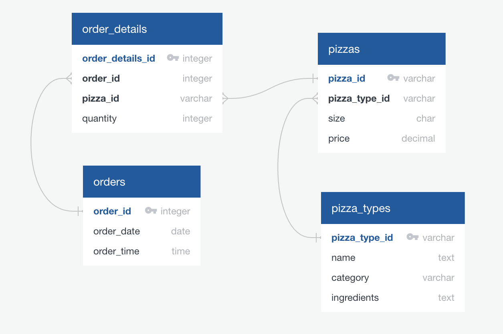

# Pizza_Place_Sales

## Overview

This project uses a year's worth of sales from a fictitious pizza place, including the date and time of each order and the pizzas served, with additional details on the type, size, quantity, price, and ingredients. Using data exploration techniques, the following questions will be answered:
- How many customers do we have each day? Are there any peak hours?
- How many pizzas are typically in an order? Do we have any bestsellers?
- How much money did we make this year? Can we identify any seasonality in the sales?
- Are there any pizzas we should take of the menu, or any promotions we could leverage?

## Resources

- PostgreSQL, pgAdmin
- Tableau Public
- Python, Pandas, Matplotlib, Seaborn
- Datasets used: [Link](https://www.mavenanalytics.io/data-playground)

## Analysis

- Data Exploration is achieved with SQL. The SQL scripts are housed in Resources/sql folder.
- An attempt is made to explore and visualize data with Python extensions. Jupyter notebooks reside in Notebooks folder.
- Tableau is also used for Data Visualizations.
- The Resources folder contains CSV files needed for data exploration. 

### Data Exploration with SQL

- Using DDL statements, the data in CSV files is loaded into PostgreSQL database. 
- The Entity Relationship Diagram is shown below:

 

- Since we do not have customer data available, orders received per day are calculated. The peak hours for pizza sales in a day are 12:00pm, 1:00 pm and 6:00pm. 
  <table>
   <tr>
     <th>Orders received per day</th>
      <th>Peak hours</th>
    </tr>
    <tr>
     <td></td>
      <td></td>
    </tr>
  </table>

- The typical number of pizzas in an order is 2. Big Meat in Small size is the best seller followed by Large Thai Chicken pizza.   
  <table>
   <tr>
      <th>Pizzas per order</th>
      <th>Best sellers</th>
    </tr>
    <tr>
      <td></td>
      <td></td>
    </tr>
  </table>

- The store recorded an annual sales of $817,860. There is no huge fluctuations in sales numbers generated for monthly sales analysis. To make a conclusion about seasonality in sales, the data should have information over 2-4 years of sales instead of just a year.
  <table>
    <tr>
     <th>Annual sales</th>
      <th>Monthly sales</th>
    </tr>
    <tr>
      <td></td>
      <td></td>
    </tr>
  </table>

- The Greek style pizza in XXL size is the least sold pizzas in the store. Small Calabrese and Small Chicken Alfredo pizzas follow in line. The store can make decisions to remove these items off the menu or tweak the recipe and promote these pizzas for lower prices.
  <table>
   <tr>
      <th>Least sold pizzas</th>
    </tr>
    <tr>
      <td></td>
    </tr>
  </table>

### Data Visualization with Tableau

- With Tableau Public, a dashboard is created from the patterns discovered. The insights gathered from SQL are the same with that of Tableau except that they are visually portrayed below. 
 

### Data Exploration and Visualization with Python extensions

